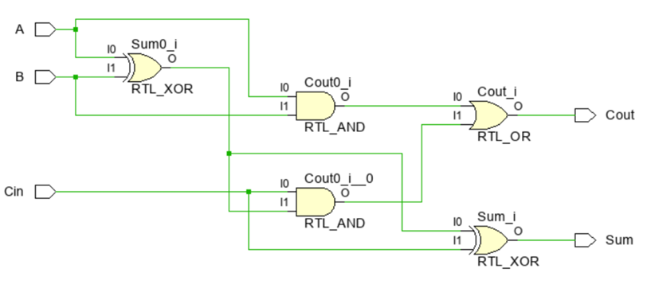
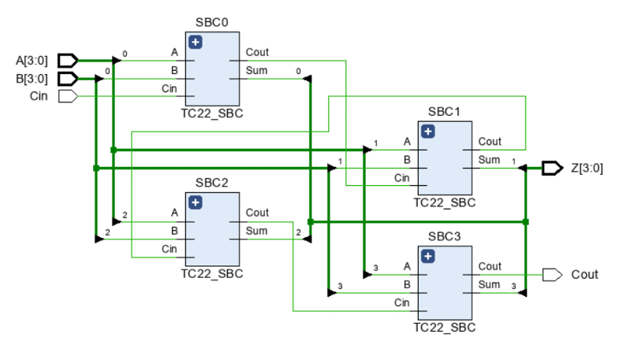
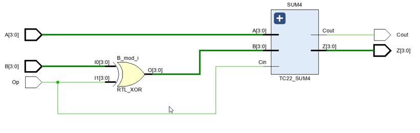
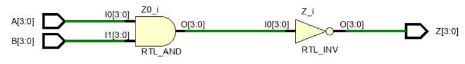
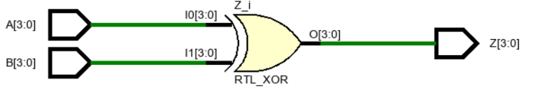
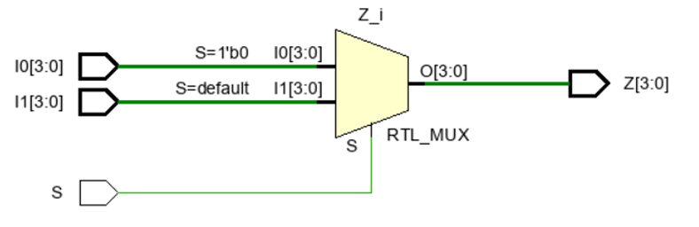
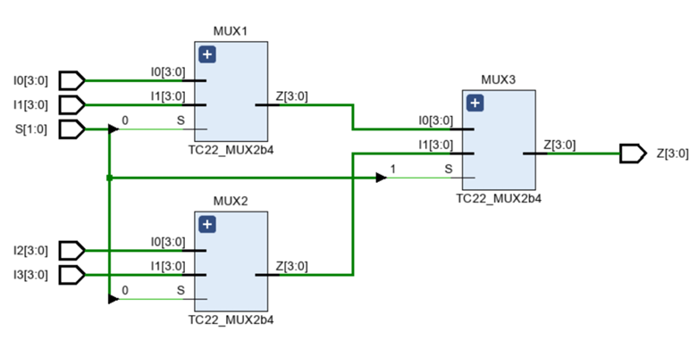
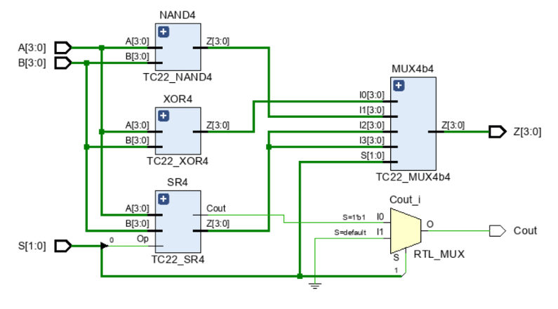

# Simple 4-bit Arithmetic Logic Unit (ALU) Design in VHDL

## Objective  
The goal of this project is to design and simulate a **combinational circuit** capable of performing four arithmetic and logic operations on two 4-bit inputs using **VHDL in Vivado**.  
By completing this project, the student will:  
- Gain essential VHDL knowledge to design combinational circuits.  
- Detect and correct design errors.  
- Verify the correctness of truth tables and simulation results.  

---

## Problem Statement  
Design a combinational system that performs **four operations** with two 4-bit numbers `A` and `B`.  
The system is a very simple **Arithmetic Logic Unit (ALU)** with the following operations:  

- `XOR`: Z = A ⊕ B  
- `NAND`: Z = ¬(A ∧ B)  
- `ADD`: Z = A + B, where A and B are in **two’s complement (Ca2)**  
- `SUBTRACT`: Z = A − B, where A and B are in **two’s complement (Ca2)**  

The ALU generates:  
- A 4-bit output `Z` (result of the selected operation)  
- A 1-bit output `Cout` (carry/borrow flag, used only in addition and subtraction, 0 otherwise)

---

## ALU Operation  

The operation is selected using the **control signals `S1` and `S0`**:  

| S1 | S0 | Operation |
|----|----|-----------|
| 0  | 0  | XOR       |
| 0  | 1  | NAND      |
| 1  | 0  | ADD       |
| 1  | 1  | SUBTRACT  |

- **Z** → 4-bit result  
- **Cout** → Carry/borrow (valid for ADD and SUBTRACT, 0 otherwise)  

---

## Project Structure  

Each module is implemented in VHDL, with circuit diagrams provided.  

- **`TC22_SBC.vhd`** – 1-bit full adder  
  - Implements sum and carry for single-bit inputs.  
  -   

- **`TC22_SUM4.vhd`** – 4-bit adder using `TC22_SBC`  
  - Instantiates four `SBC` units for bitwise addition.  
  -   

- **`TC22_SR4.vhd`** – 4-bit sum/subtract unit with carry  
  - Uses `TC22_SUM4` plus additional combinational logic for subtraction.  
  -   

- **`TC22_NAND4.vhd`** – 4-bit NAND unit  
  - Performs bitwise NAND of inputs A and B.  
  -   

- **`TC22_XOR4.vhd`** – 4-bit XOR unit  
  - Performs bitwise XOR of inputs A and B.  
  -   

- **`TC22_MUX2b4.vhd`** – 2-to-1 multiplexer (4-bit data)  
  - Selects between two 4-bit inputs.  
  -   

- **`TC22_MUX4b4.vhd`** – 4-to-1 multiplexer using `MUX2b4`  
  - Selects between four 4-bit inputs based on S1, S0.  
  -   

- **`TC22_ALU4.vhd`** – Complete 4-bit ALU  
  - Instantiates `SR4`, `XOR4`, `NAND4`, and `MUX4b4` to build the ALU.  
  -   

- **`TB_TC22_ALU4.vhd`** – Test bench  
  - Provides predefined simulation vectors.  
  - 

---

## Simulation Plan  

**Simulation intervals:**

| Time (ns) | Operation | Inputs (A, B) |
|-----------|-----------|---------------|
| 0–10      | A + B     | 2, 3          |
| 10–20     | A − B     | 2, 3          |
| 20–30     | A + B     | -5, 3         |
| 30–40     | A − B     | -5, 3         |
| 40–50     | A + B     | 5, 3          |
| 50–60     | A ⊕ B     | 1011, 0100    |
| 60–70     | A NAND B  | 1011, 0100    |

---

## ALU Output Results  

| Time (ns) | Output (Z) | Cout | Decimal (Ca2) |
|-----------|------------|------|----------------|
| 5         | 0101       | 0    | 5              |
| 15        | 1111       | 0    | -1             |
| 25        | 1110       | 0    | -2             |
| 35        | 1000       | 1    | -8 (overflow)  |
| 45        | 1000       | 0    | 8 (incorrect)  |
| 55        | 1111       | 0    | -1             |
| 65        | 1111       | 0    | -1             |

### Simulation Waveforms  

**5 ns – Result = 0101 (5 in Ca2)**  
  

**15 ns – Result = 1111 (-1 in Ca2)**  
  

**25 ns – Result = 1110 (-2 in Ca2)**  
  

**35 ns – Result = 1000 with Cout=1 (−8 in Ca2, overflow detected)**  
  

**45 ns – Result = 1000 with Cout=0 (incorrect, shows +8)**  
  

**55 ns – Result = 1111 (−1 in Ca2)**  
  

**65 ns – Result = 1111 (−1 in Ca2)**  
  

---

## Discussion of Results  

At **35 ns**, the ALU outputs `Z = 1000` and `Cout = 1`.  
- Interpreted in two’s complement (4 bits), this corresponds to **-8**.  
- The result is **correct**, since the carry indicates that the sum exceeded the representable range.  

At **45 ns**, the ALU outputs `Z = 1000` and `Cout = 0`.  
- This would correspond to **+8**, but it is **not correct** in two’s complement.  
- The absence of `Cout = 1` shows that the ALU did not detect overflow properly.  

In two’s complement arithmetic with 4 bits, the valid range is **-8 to +7**. Any result outside this range must trigger an **overflow flag**.  
This case illustrates how the ALU must correctly handle overflow detection to maintain valid two’s complement behavior.  

